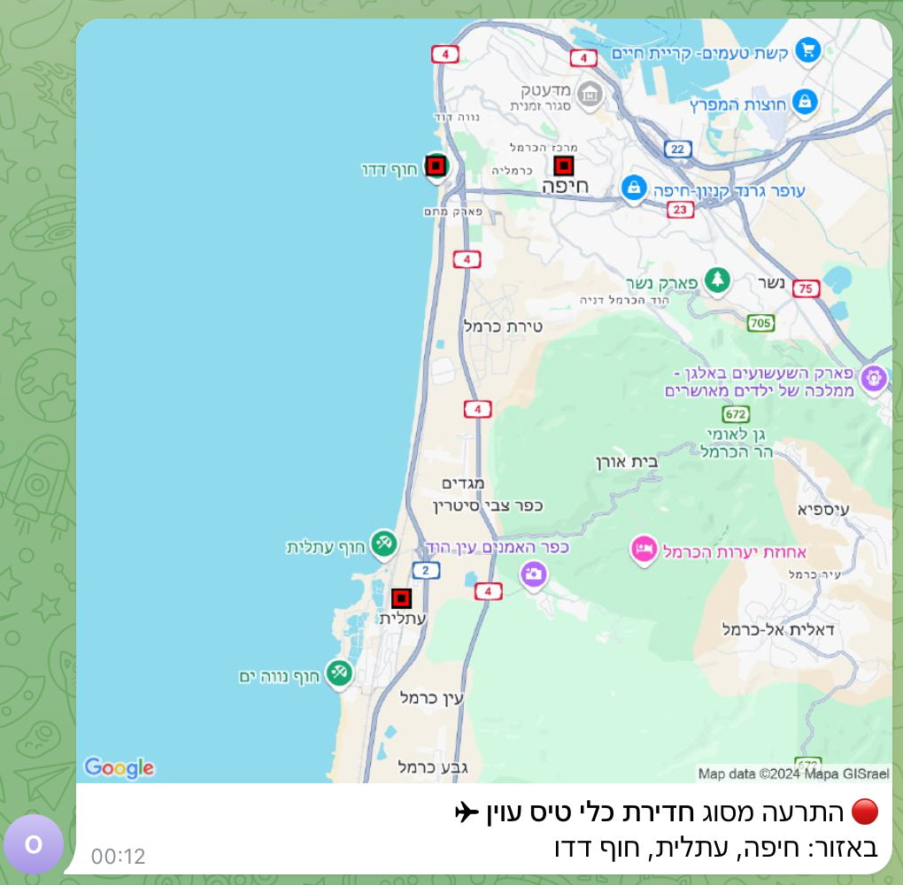

# Alert Go

Emergency alert monitoring system with Telegram notifications and map visualization.
- 🔔 Alert monitoring via polling from Oref public API endpoint
- 🗺️ Google Maps integration for visual location context
- 📍 Location filter

#### Screenshot


#### Howto
Create a local `.env` file and populate the following variables:
```
POLL_INTERVAL=5s
TARGET_LOCATION_FILTER=<LOCATION>
TELEGRAM_CHAT_ID=<ID>
TELEGRAM_BOT_TOKEN=<TOKEN>
GOOGLE_MAPS_API_KEY=<KEY>
```

Run with `go run main.go`
Build to a single binary with `GOOS=linux GOARCH=amd64 go build -o app main.go`